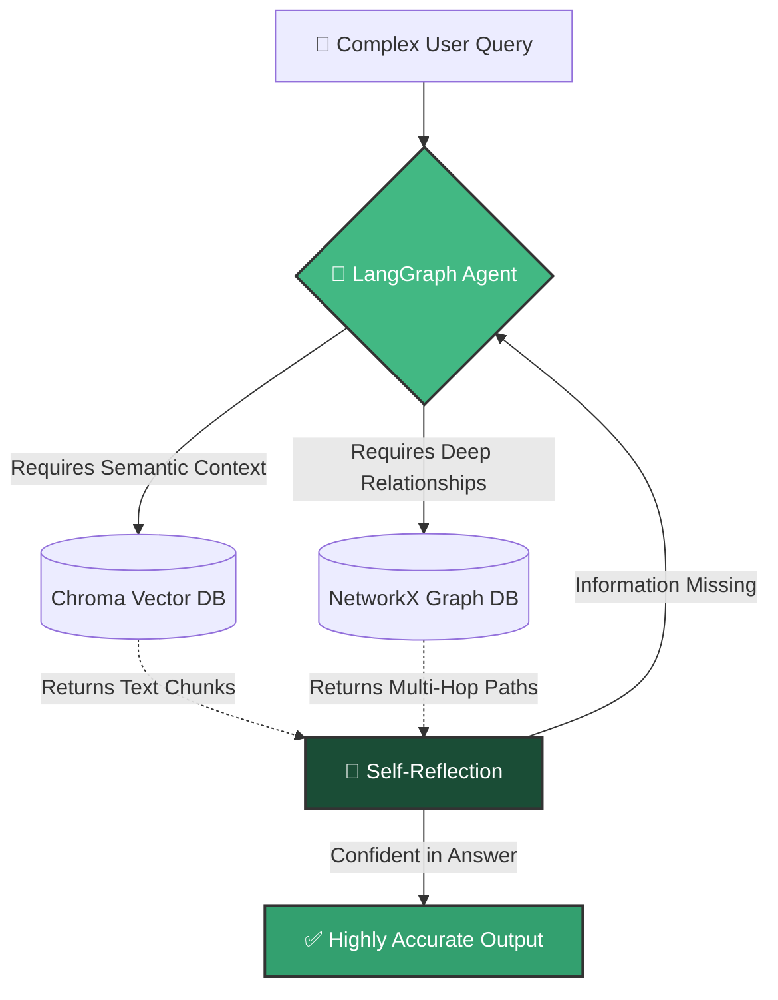

The **DocRagGraph** system represents a massive leap in generative AI capabilities. By fusing **Vector Search** with a **Knowledge Graph**, it solves the most fundamental limitations of standard AI document query systems.

## The Problem with Traditional RAG

Traditional Retrieval-Augmented Generation (RAG) relies entirely on semantic vector search. When you ask a question, it finds paragraphs that have similar wording or meaning.

**Where it fails:**
- **Multi-Hop Reasoning:** If you ask, "How is the CEO of Company A related to the new product launch?", standard RAG will find a chunk mentioning the CEO, and a chunk mentioning the product, but it often fails to connect the dots if they aren't explicitly linked in the same sentence.
- **Global Context:** Standard RAG cannot summarize the overarching theme of a massive document because it only retrieves fragmented chunks.
- **Hallucinations:** Without hard-linked facts, the LLM is forced to guess connections between retrieved chunks, leading to inaccuracies.

## Why GraphRAG is the Superior Approach

**DocRagGraph** solves these issues by extracting an explicit Knowledge Graph during the ingestion phase. It maps out **Entities** (people, places, concepts) and the exact **Relationships** between them.

When a query is made, our LangGraph-powered **Agentic Loop** springs into action:
1. **Decision Making**: The AI agent analyzes your question and decides if it needs a semantic chunk, a relationship trace, or both.
2. **Graph Traversal**: It walks the nodes of the graph (e.g., *CEO* ➔ *leads* ➔ *Project X* ➔ *relies on* ➔ *Product Y*) to find verified connections.
3. **Self-Reflection**: It evaluates the context it found. If the answer is incomplete, it automatically loops back and searches deeper into the graph before returning a final answer.

---

## Customer Selling Points & End-Product Use Cases

For enterprise clients and end-users, this isn't just a chatbot; it's a **Cognitive Knowledge Engine**.

### 1. Enterprise Contract & Legal Analysis
Lawyers deal with contracts referencing dozens of subsidiaries, clauses, and external entities. Traditional RAG struggles to map these complex webs. **End Product:** An AI Legal Assistant that can instantly answer, "Which subsidiaries are affected if Clause 4 is breached?" by traversing the graph.

### 2. Medical & Research Literature Review
Researchers need to connect symptoms, proteins, and drug trials across hundreds of papers. **End Product:** A biomedical discovery tool that finds non-obvious relationships (e.g., tracing how a side-effect in one study links to a mechanism in another).

### 3. Financial Due Diligence
Analysts can ingest financial reports to map out corporate structures and dependencies. **End Product:** A risk-assessment dashboard that autonomously flags if a parent company's supply chain is fundamentally tied to a struggling vendor.

**The Ultimate Value:** It provides the speed of search with the analytical depth of a human researcher, dramatically reducing hallucinations and unlocking insights that are mathematically impossible for traditional vector databases to find alone.
