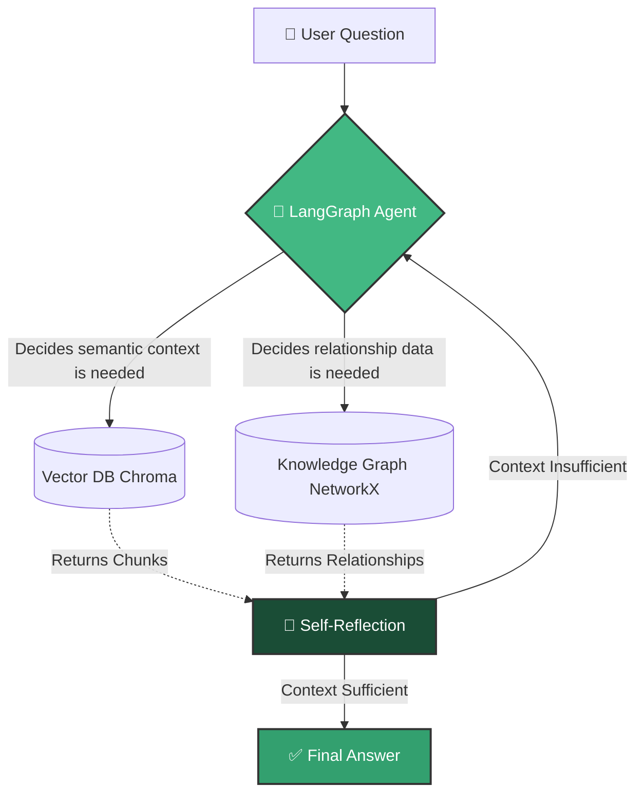

The **DocRagGraph** system represents a significant leap over standard Retrieval-Augmented Generation (RAG). Instead of relying solely on vector similarity (which struggles with complex, multi-hop reasoning), it dynamically fuses **Vector Search** with a **Knowledge Graph**.

## How the Agentic Loop Works

The core of the system is a LangGraph-powered **ReAct Agent**. When you ask a question, the agent doesn't just blindly query a database. It thinks, decides which tool to use, analyzes the result, and loops if it needs more information.

### 1. Vector Search Tool
Powered by `Alibaba-NLP/gte-Qwen2-1.5B-instruct` embeddings, this tool excels at finding specific paragraphs, definitions, and semantic matches from the source PDF.

### 2. Graph Search Tool
Powered by an LLM parsing the document during the ingestion phase, this tool traces edges between specific entities. If you ask "How does Company A relate to Product B?", the agent will traverse the nodes in NetworkX to construct a multi-hop answer that a vector database would typically miss.
